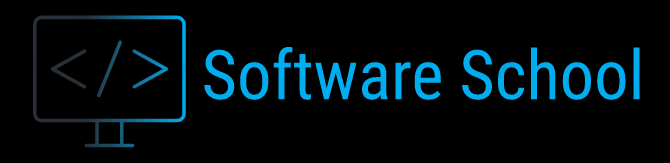

  

# Content 
1. [Introduction](#introduction)
2. [UX](#ux)
3. [Wireframe](#wireframe)
4. [Visual Identity](#visualidentity)    
5. [Site Overview](#siteoverview)
6. [User Stories](#userstories)
7. [Testing](#testing)
8. [Deployment](#deployment)
9. [Code Validation](#codevalidation)
10. [Technologies](#technologies)
11. [Media](#media)
9. [Acknowledgements and thanks](#acknowledgements)

## Introduction 

Software School is an education and mentoring business that offers courses to study in classrooms and online. And conferences is also offered at, for example, trade fairs and companies for skills development.
It was created by a student who studies at the Code Institute and who has ambitions to become a Software Developer.
The content creator knows how important it is to study in the right way and in a flexible environment when needed.

*This site has been created for a school business project and for the exercise purposes. 
This is my first project for the Code Institute Diploma in Full Stack Development.*

## UX 

My goal was to have an intuitive, professional and stylish website. Since all content is on one page, the main function is to easily
access the sections and navigate to the contact form, to contact the content creator. The navigation bar is looking simple and clean, and takes you to different parts of the page in one click.
The appearance of the page looks the same from top to bottom.

- **Home section:**

The design of the Home section is simple and gives a bright introduction of who the person on the front of this business is. 
The background is clean white which makes the portrait, name and title stand out. 
There is also a "Go to Courses" button, the goal is to showcase the offered courses and to make it easier navigationg to the courses section. 

- **Education section:**

This section is simple and clear. There are two different methods to study. Either you study in a classroom or online. 
In classrooms you study for three months and when studying online there is no time limit. The business also offers conferences, 
for example, speech can be kept for training and general understanding of what programmers do.

- **Courses section:**

In this section, responsive layout is achieved using grids. The first course contains languages for learning Front-End Development. 
The second course contains Python and MySql and the third course is about Django. 
Each course has its own Modal pop-up which opens when you click on the "Description" button. 
The Modal pop-up contains information about how many ects points the course gives and that you get a certificate immediately. Each Modal also contains an introductory clip. 
The clips have been added from Youtube using embed links.There is also information about the tutor, what rating the course has received and special discounts. 

- **Contact section:**

The contact section follows the theme of Bootstrap horizontal grid system, which includes booking forms for contacting the school. 
Contact information includes name, email address and a message input. By filling out the form, and submitting it by clicking send button 
target attribute is received at a blank page with information needed.

- **Footer:**

I divided my footer section into two parts. On one part I wanted to add a small presentation about the mentor / tutor. 
After the short presentation, there is contact information, telephone number and email address for the school. 
Then there are also buttons that take us to social media. The second part is Quick Links, by selecting a button you are 
taken directly to a specific section, which makes the user-friendliness better and the navigation much easier.
